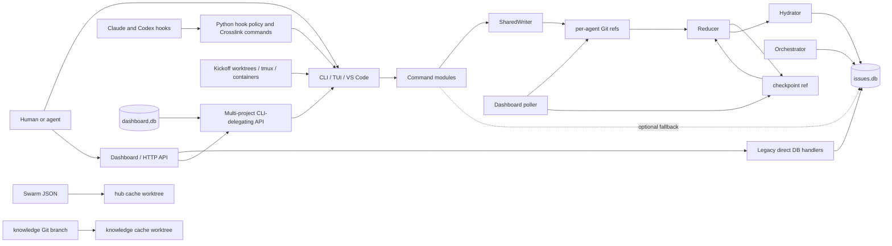
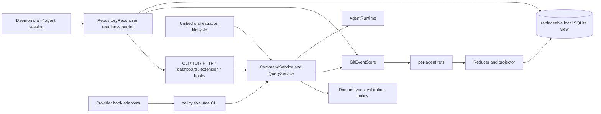
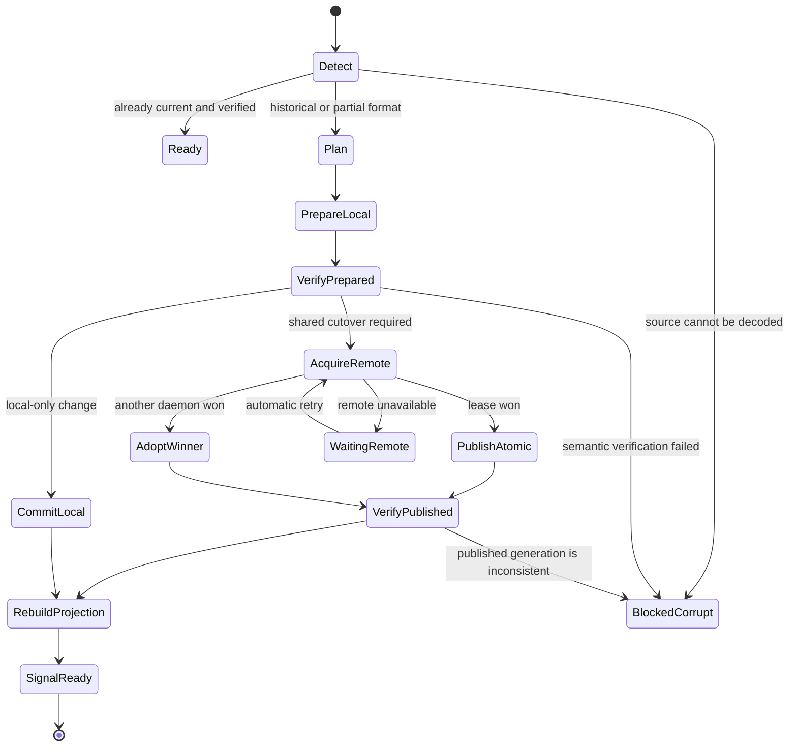

# Crosslink architecture overhead map

- Status: repository-grounded audit baseline
- Date: 2026-08-19
- Revision: `35255a1703eff256cd1b6219f5a207e86ed9b263` (`origin/develop`)
- Scope: current architecture, ownership, persistence, enforcement, compatibility, failure paths, and safe refactor seams

## Executive conclusion

Crosslink does not need a speculative rewrite or a blind file-by-file cleanup. Its useful core is already visible: Git-native per-agent event refs provide the shared, synchronizable authority; a reducer produces a materialized issue graph; SQLite provides fast local queries; provider hooks enforce the workflow; and isolated worktrees run agents. Those choices fit the problem better than a synchronized SQLite database or instruction-only agent behavior.

The problem is that the implementation does not consistently preserve those boundaries. There are multiple mutation paths, two overlapping dashboard architectures, at least four orchestration/pipeline lifecycle models, v2 and v3 storage assumptions in live paths, provider policy split between Python and Rust, and a very broad binary/module surface. Failures often degrade silently from shared writes to local-only state. The largest risks are therefore authority ambiguity and recovery ambiguity, not raw file count.

The recommended direction is an incremental strangler refactor around four hard boundaries:

1. One application command service owns every domain mutation and writes the Git event authority.
2. Reducers and projectors consume immutable Git state; SQLite is explicitly disposable local projection state, with local-only data separated from shared-looking tables.
3. Provider hooks remain mandatory and fail closed for protected actions, while their decisions move behind stable Crosslink binary commands and thin provider adapters.
4. A repository reconciler is a mandatory daemon-start readiness barrier: it detects every supported historical storage format, migrates directly to the current format, verifies and publishes the result, rebuilds local projections, and only then permits agent activity.

The correct first work is the reconciliation substrate and historical fixture corpus described below, followed by the vertical audits and contract-preserving extractions. Trimming files before those boundaries exist would make the repository smaller while leaving the dangerous coupling intact.

## Non-negotiable invariants

- Shared coordination state remains Git-native and synchronizable through ordinary Git remotes.
- SQLite is never synchronized between developers. It may be rebuilt locally as a query projection.
- Claude and Codex hooks remain mandatory enforcement. Skills and prompt instructions may improve behavior, but cannot replace hooks.
- `crosslink init` continues to install both Claude and Codex project integrations by default, with an explicit provider-selection override.
- `agent.provider` remains the explicit `claude | codex | custom` selector. `agent.binary` remains an executable override and legacy inference path.
- Account-login provider authentication remains the supported model; Crosslink does not require provider API keys.
- The web safety boundary remains a filter/provenance reminder around provider-native web results. Crosslink must not become a page downloader or proxy.
- Zero-byte `.crosslink/rules/*.md` assets remain installed and connected to the prompt-hook mechanism until their compatibility contract is deliberately migrated.
- Existing v2/v3 repositories must have an explicit migration path. Compatibility behavior may only be deleted after callers and persisted layouts are proven absent or converted.
- Starting a current Crosslink daemon in a repository with an agent automatically reconciles every supported historical shared-store and local-database format. Normal migration requires no user-run sequence of migrate, finalize, remigrate, or ref-renaming commands.
- Shared migration happens once per Git remote; other clones adopt the winning migration when their daemon starts. Local SQLite projection migration/rebuild happens independently in each clone.
- Migration is idempotent, resumable, semantically verified, recoverable from archived refs/backups, and guarded against concurrent daemons. A daemon never reports ready or permits agent mutation after an incomplete or unverifiable migration.
- Refactors must preserve offline work, multi-developer convergence, issue identity, lock semantics, and recoverability from Git without relying on a particular local SQLite file.

## Audit method and completeness criteria

This map follows runtime ownership rather than directory names. A subsystem is considered mapped when its entrypoints, source of truth, derived state, external interfaces, concurrency boundary, failure behavior, and compatibility burden are identified.

The map is complete enough to begin vertical audits when it provides evidence for:

- every user-facing runtime surface;
- every durable state family and the component allowed to mutate it;
- the normal write, sync, reduce, hydrate, and read flows;
- known direct-write paths that bypass the intended authority;
- provider hook installation and execution boundaries;
- process and worktree lifecycles;
- v2/v3 and generated-asset compatibility;
- the highest-risk failure and recovery paths;
- an ordered refactor sequence with testable exit conditions.

This document is an overhead map, not permission to remove a named subsystem. Each removal still requires a caller and persistence audit.

## Repository scale and shape

The repository is one Rust package with several product surfaces around it:

| Surface | Implementation | Role |
|---|---|---|
| CLI | `crosslink/src/main.rs`, `crosslink/src/commands/` | Primary command interface and composition root |
| Rust library | `crosslink/src/lib.rs` | Exposes most internal modules as a public crate surface |
| Terminal UI | `crosslink/src/tui/` | Local issue/session/agent interface over SQLite and command logic |
| HTTP/WebSocket server | `crosslink/src/server/` | Legacy single-project API plus common server shell |
| Multi-project dashboard backend | `crosslink/src/dashboard/` | Project registry, polling, actions, PTY sessions, GitHub/export/webhooks |
| Dashboard frontend | `dashboard/` | React application embedded or served by the Rust binary |
| VS Code extension | `vscode-extension/` | Bundles/validates a binary, starts the daemon, and shells out to CLI commands |
| Agent providers | `crosslink/src/agents/` | Claude, Codex, and custom invocation adapters |
| Provider integration assets | `crosslink/resources/agent/`, `crosslink/resources/providers/` | Canonical hooks, skills, schemas, instructions, and provider projections |
| Codex plugin projection | `crosslink/resources/plugins/crosslink-codex/` | Generated plugin distribution checked against canonical assets |
| Shared coordination | `hub_v3`, `hub_source`, `shared_writer`, `sync`, `compaction` | Git-ref event store, replication, reduction, and checkpoints |
| Local projection | `db`, `hydration` | SQLite query model and local operational records |
| Agent execution | `commands/kickoff/` | Worktrees, tmux or containers, provider process, sentinels, monitoring |
| Multi-agent planning | `commands/swarm/`, `orchestrator/` | Two overlapping orchestration/state machines |
| Automated review pipeline | `pipeline.rs`, `findings.rs`, `seam.rs`, `issue_filing.rs` | Repository partitioning, multi-agent review, finding consolidation, and GitHub filing |
| Knowledge | `knowledge/`, `commands/knowledge*` | Separate Git-backed Markdown knowledge branch and cache worktree |

At the audited revision, Rust source and tests are approximately 97,000 lines across a single crate. `main.rs` is approximately 3,300 lines and owns both the Clap schema and dispatch. `lib.rs` exports nearly the same module tree that `main.rs` declares again, so shared modules are compiled into both library and binary targets rather than composed through a thin binary. The size is a symptom; the structural issue is that command routing, compatibility, persistence selection, and product entrypoints all meet in the same crate.

`build.rs` also crosses a build/runtime boundary: it generates embedded asset tables and creates a source-tree dashboard placeholder when `dashboard/dist/index.html` is absent. A build should consume inputs and write generated output under `OUT_DIR`; it should not repair the source tree.

The CLI breadth falls into seven overlapping product areas:

| Area | Representative commands | Architectural owner today |
|---|---|---|
| Issue tracking | `issue`, comments, milestones, archive, import/export, scheduling, timers | command modules plus SQLite/optional SharedWriter |
| Sessions and coordination | `session`, `agent`, `locks`, `trust`, `context`, `workflow` | database, v3 refs, hooks, and compatibility helpers |
| Execution | `kickoff`, `sentinel`, `mc`, `container` | kickoff runtime plus separate supervisors |
| Orchestration/review | `swarm`, design pipelines, automated review/fix/file/merge | swarm JSON, top-level pipeline, kickoff pipeline, orchestrator |
| Storage operations | `sync`, `compact`, `integrity`, `migrate`, `prune` | sync/reducer/migration modules with v2/v3 branching |
| Knowledge/integration | `knowledge`, external knowledge/issues, GitHub/dashboard actions | separate caches, Git branches, CLI/API adapters |
| Setup/presentation | `init`, `config`, `doctor`, TUI, `serve`, `dashboard` | embedded assets, config registry, server/dashboard/TUI |

## Current architecture at a glance

Solid arrows represent intended ownership or delegation. Dotted/local arrows show fallback or bypass paths that create authority ambiguity.

## Desired dependency direction

The critical rule is that interfaces do not select between Git and SQLite mutation implementations. They call the same application service. Local-only operation, if retained, is an explicit mode with visibly different identifiers and guarantees—not an error fallback.

## Durable state and ownership map

| State | Current location | Intended authority | Current writers | Main readers | Assessment |
|---|---|---|---|---|---|
| Shared issue events | `refs/heads/crosslink/agents/<agent-id>:events.log` | Per-agent append-only Git ref | `hub_v3`, `SharedWriter` | `RefHubSource`, reducer | Correct authority shape; append rewrites the full log blob |
| Heartbeat | each agent ref `heartbeat.json` | Owning agent ref | `hub_v3::write_heartbeat_to_ref` | daemon, watcher, dashboard | Good single-writer ownership; shares ref CAS with events and requests |
| Agent requests/acks | each agent ref `requests-out/`, `requests-ack/` | Driver/target-owned refs | `hub_v3` request functions | polling and dashboard | Clear owner, but shares a growing multi-purpose ref |
| Materialized shared state | `refs/heads/crosslink/checkpoint:state.json` | Derived from all agent refs | any writer/fetch path that reduces | hydration, dashboard, migration | Cache, not authority; global watermark correctness is insufficient |
| Hub metadata | `refs/heads/crosslink/meta:hub.json` | Hub protocol metadata | migration/init | detection/migration | Appropriate separate control ref |
| Local issue/query model | `.crosslink/issues.db` | Disposable projection plus local operational state | hydrator, many commands, old HTTP API, orchestrator | CLI, TUI, server | Boundary is porous; shared-looking records can exist only here |
| Local sessions/timers | `.crosslink/issues.db` | Local operational state | session/timer/daemon | CLI, hooks, daemon | Legitimately local, but co-located with the rebuildable projection |
| Hub host worktree | `.crosslink/.hub-cache` on `crosslink/hub-v3-host` in v3 | Implementation host only | sync plus legacy file paths | v2 compatibility, swarm, some commands | Host worktree is still treated as authority by legacy paths |
| Swarm state | `.hub-cache/swarm/**/*.json` | Undefined under v3 | swarm commands commit worktree files | swarm commands | Separate shared state model not represented by v3 events/checkpoint |
| Orchestrator state | local JSON plus SQLite mutations | Local plan/execution state | `orchestrator::executor` | orchestrator | Duplicates swarm/kickoff lifecycle and bypasses shared writes |
| Knowledge | `crosslink/knowledge` branch | Git branch | knowledge commands | knowledge cache/search | Valid separate content authority, but dirty cache blocks rebase-based reads |
| Knowledge cache | `.crosslink/.knowledge-cache` | Derived worktree with local edits | knowledge sync/edit | knowledge commands | Recovery and dirty-worktree behavior are coupled to reads |
| External repository cache | `.crosslink/.external-cache/<hash>/` | Derived remote cache | `external::ExternalCache` | external issue/knowledge commands | Separate TTL/cache protocol; v2 hub branch assumptions remain |
| Dashboard registry | `~/.crosslink/dashboard.db` | Local dashboard state | dashboard API/poller/actions | dashboard backend | Correctly local; must never become project coordination authority |
| Provider team config | `.crosslink/hook-config.json` | Repository configuration | init/config CLI/user | providers, hooks, workflows | Canonical team layer |
| Provider local config | `.crosslink/hook-config.local.json` | Machine/user override | config CLI/user | provider resolver | Correct override layer; dotted and nested forms add compatibility complexity |
| Agent identity and private keys | `.crosslink/agent.json`, host `.crosslink/keys/`, `driver-key.pub` | Local machine/worktree identity and signing secret | init/agent commands | writer, trust, dashboard capability checks | Worktree identity and host-owned keys have different portability/backup rules |
| Local agent control flags | `.crosslink/agent-flags/{paused,kill,reprioritise.json}` | Local process-control projection of shared requests | request poller/agent commands | running agent hooks/process | Shared request/ack and local acted state must be reconciled |
| Daemon process state | `.crosslink/daemon.pid`, `daemon.log`, `session.json` | Local process/derived session state | daemon | daemon commands and integrations | PID/liveness and last flushed session are machine-local |
| Installed integration manifest | `.crosslink/init-manifest.json` | Generated-install provenance | init/update | three-way asset updater | Useful generated ownership record |
| Runtime agent files | worktree sentinels plus `.crosslink/runtime/agent-events.jsonl` | Ephemeral execution evidence | kickoff runner/hooks/agent | kickoff monitor | Multiple partially overlapping completion signals |
| Design-run pipeline state | `.design/<design>.pipeline.json` and `.plan.json` | Local/repository workflow record | kickoff pipeline helpers | kickoff wizard/monitor | A separate `PipelineState` and `RunRecord` vocabulary beside swarm review |
| Automated review pipeline | `.crosslink/pipeline.json` plus `.hub-cache/swarm/review-*.json` and reports | Mixed local/shared review state | top-level pipeline and swarm review | swarm review commands | Another lifecycle model; can also file external GitHub issues |

Operational snapshot from this repository on 2026-08-19, included only as scale evidence: 786 projected issues, 1,417 comments, 8 sessions, a roughly 1.6 MB SQLite file, a roughly 1.74 MB checkpoint, 161 checkpoint commits, and three observed agent refs whose event logs totaled 332 commits. These numbers are not protocol invariants.

## Shared write, sync, and read flows

### Shared mutation path

The intended v3 flow is:

1. A command constructs a domain event through `SharedWriter`.
2. `hub_v3::append_inner_impl` reads and parses the owning agent's complete `events.log`, appends one NDJSON line in memory, writes a new blob/tree/commit, and advances the ref with compare-and-swap.
3. `SharedWriter::commit_v3` pushes the owning ref. Push failure can return `LocalOnly`.
4. The writer fetches and adopts other agents' refs.
5. `compaction::reduce` folds the checkpoint plus events after its watermark.
6. The writer serializes and pushes a new checkpoint. Checkpoint serialization, write, or push failure is logged as non-fatal.
7. The command updates or hydrates SQLite for local reads.

This gives each agent a natural single-writer ref and avoids Git merge conflicts. It also makes a single logical mutation depend on several independently fallible steps whose result is not consistently surfaced to the caller.

### Reduction and checkpoint model

`CheckpointState` stores the full issue graph, milestones, locks, identifier maps, warnings, and one optional global `OrderingKey`. The key is `(timestamp, agent_id, agent_seq)`. Reduction reads events strictly greater than that global key, sorts them by the same ordering, applies them, and moves the watermark to the last applied event.

That is deterministic for the events visible during a reduction, but it is not a sufficient causal frontier for offline multi-writer delivery. An event arriving later with an ordering key below the global watermark can be skipped forever. Clock-skew warnings report part of the problem without fixing it. A correct checkpoint needs a per-agent frontier such as `{agent_id -> highest applied sequence and/or ref tip}`, with validation that no prefix was omitted.

Checkpoint adoption has a second ordering defect. `sync::cache::adopt_checkpoint_by_watermark` reduces the watermark to `agent_seq` alone and adopts the remote checkpoint when that number is greater than or equal to the local value. Sequence numbers belong to individual agents, so they cannot order checkpoints globally without timestamp, agent identity, or a causal frontier.

### Projection and hydration

`hydrate_from_state` temporarily disables foreign keys, clears shared issue-related tables in one transaction, rebuilds them from reduced state, and then restores SQLite-only issues whose `created_by` is null. Dependency and relation insert failures warn and continue. This makes SQLite neither fully disposable nor clearly authoritative: a rebuildable shared projection and local-only issue records occupy the same domain tables.

The durable redesign is not to sync SQLite. It is to separate:

- shared projection tables, which can be dropped and rebuilt from Git refs;
- explicitly local operational tables for sessions, timers, caches, and drafts;
- optional local-only work items with a distinct type/identifier namespace and an explicit promotion command.

Schema migration currently weakens that guarantee. `Database::migrate_batch` logs most SQL failures and returns no error; `init_schema` then advances `PRAGMA user_version` to the latest schema. A partially migrated database can therefore claim to be current. Migration steps must be transactional, return errors, and only advance the version after their postconditions pass.

### Silent local fallback

`main::get_writer` converts every `SharedWriter::new` error into `None`. Many command handlers accept an optional writer and directly mutate SQLite when it is absent. That is useful for intentionally local repositories, but it is unsafe as an implicit response to hub corruption, migration failure, identity failure, or sync misconfiguration. The same command can appear successful while no shared event exists.

The replacement contract should distinguish three states before dispatch:

- `Shared`: a healthy Git authority is required; inability to open it fails the command.
- `Local`: an explicitly selected local-only repository or local draft operation.
- `ReadOnlyDegraded`: shared state may be inspected, but mutation is refused until repaired.

## Mutation surface audit

| Surface | Current mutation behavior | Required boundary |
|---|---|---|
| CLI issue commands | Prefer optional `SharedWriter`, otherwise direct SQLite | Always call `CommandService`; mode selected before command execution |
| Session handoff/comments | Attempts writer, then can fall back to DB | Shared issue comments must fail visibly if shared write fails; session metadata remains local |
| Kickoff/sentinel/swarm helpers | Mix optional writer and direct DB | Use the same application commands as CLI |
| Legacy `/api/v1` issue and milestone handlers | Direct `Database` mutations | Replace with service calls or retire after API compatibility audit |
| New dashboard API | Records action, shells out to `crosslink`, then runs `crosslink sync` | Keep delegation initially; later call stable service interface in-process |
| Orchestrator executor | Directly creates/closes SQLite issues and milestones and writes local JSON | Merge into unified orchestration lifecycle using `CommandService` |
| TUI | Reads local projection and reaches command/database paths | Commands through service; reads through `QueryService` |
| VS Code extension | Shells out to CLI and starts daemon | Good outer boundary; stabilize JSON command protocol and version negotiation |
| Import/external/compatibility commands | Several specialized storage paths | Explicit adapters that emit domain commands or remain clearly local/read-only |

The highest-value extraction is therefore not moving files. It is making bypassing the application service impossible from production entrypoints.

## Locking, trust, and enforcement

### Locks

Locks are events, not an atomic remote mutex. The reducer accepts the first claim in deterministic event order, ignores a claim from another agent while a lock exists, and permits only the owner to release. The claim flow emits, compacts/pushes, fetches, re-reduces, and confirms the winner. This is a cooperative eventually confirmed lease protocol.

That behavior is acceptable only when hooks prevent protected work before confirmation and when stale-lock recovery is explicit. `clear_stale_lock_state` still prunes v2-style worktree event files, edits filesystem checkpoint state, and removes `locks/<id>.json`; that is a v2 compatibility path crossing into v3 lock handling and requires a focused audit before changes to lock semantics.

### Signatures and trust

The reducer's `check_unsigned` records warnings for unsigned or invalid events and then applies them. Git signing setup and trust files exist, but event authenticity is advisory at the core reduction boundary. Configuration exposes signing enforcement language that is stronger than the reducer's behavior.

The architecture needs an explicit trust policy result for every input event:

- accepted and applied;
- quarantined and excluded pending trust;
- rejected with a durable diagnostic;
- accepted under an explicitly configured permissive mode.

Policy must be evaluated before state mutation, and checkpoint metadata must record the trust policy/version used.

### Provider hooks

Hooks are a required control plane. They enforce work ownership, post-edit tracking, heartbeats, session setup, prompt checks, and provider event normalization. They cannot be replaced by skills or prose because models do not reliably choose to follow workflow instructions.

Canonical assets live under `crosslink/resources/agent/`; Claude and Codex layouts under `crosslink/resources/providers/` are projections. `crosslink init` installs both integrations by default and supports an explicit selection override. The Codex plugin is another generated projection, synchronized by `crosslink/scripts/sync-codex-plugin.py` and checked through generated hashes.

The current policy implementation is split between substantial Python scripts—especially `work-check.py`—and Rust CLI behavior. The safe refactor is:

1. retain provider-native hook registration and fail-closed exit behavior;
2. reduce hook scripts to input normalization and output formatting;
3. call stable binary commands such as `crosslink policy evaluate --event ...`;
4. keep one tested policy engine over normalized provider events;
5. generate Claude, Codex, plugin, and local project projections from the canonical schema.

The pre-web hook is now a provenance/content-boundary filter and does not download pages. That is the correct responsibility. Claude exposes a local pre-web hook event; hosted Codex web search does not currently pass through an equivalent local hook, so parity cannot be claimed. This provider capability gap must be visible and tested without weakening the mandatory edit/workflow hooks or reintroducing a fetch proxy.

## Agent execution and orchestration

### Kickoff

Kickoff is the strongest existing execution primitive. It creates isolated worktrees, writes invocation metadata and completion criteria, launches the selected provider in tmux or Docker/Podman, emits normalized runtime events, and monitors process plus sentinel state. Local tmux kickoff is unavailable on Windows; container execution is the cross-platform alternative.

The completion protocol is fragmented across `.kickoff-status`, `.kickoff-session`, `.kickoff-metadata.json`, plan/criteria/report JSON, and `.crosslink/runtime/agent-events.jsonl`. Some state is written by Crosslink, some by hooks, and some by the model following its prompt. A unified `RunRecord` should distinguish Crosslink-observed facts from agent-reported claims and derive one state machine:

`created -> starting -> running -> awaiting_verification -> succeeded | failed | cancelled | lost`

### Swarm

Swarm plans phases and agents, launches kickoff workers, tracks budgets and reports, performs review/fix cycles, and merges branches. Its state is pretty-printed JSON under `.hub-cache/swarm/`, committed by generic worktree Git commands. Under v3, the cache worktree is an implementation host on `crosslink/hub-v3-host`; swarm state is not part of per-agent event refs or the checkpoint protocol. Some lifecycle paths still push the `crosslink/hub` branch constant.

This is not merely old code. It is a separate shared-state authority with unclear v3 replication semantics. Swarm state must either become a typed v3 event domain with per-owner refs or be explicitly local orchestration state whose durable outcomes are written through normal Crosslink commands.

### Orchestrator

`orchestrator/` implements another DAG/executor with local JSON state and direct SQLite mutations. It overlaps swarm planning and kickoff execution while following a different persistence model. Maintaining both creates duplicated lifecycle states, recovery rules, and failure handling.

There are also two unrelated types named pipeline. `commands/kickoff/pipeline.rs` stores per-design planning and run rows beside `.design` documents. The top-level `pipeline.rs` stores an automated review/fix/file/merge state machine in `.crosslink/pipeline.json`, while its reports and plans also flow through swarm hub JSON. Together with swarm and `orchestrator/`, this gives Crosslink at least four overlapping lifecycle vocabularies.

The recommended target is one orchestration service using kickoff as its process runner and `CommandService` for issue/milestone/comment outcomes. Existing swarm and orchestrator commands can remain adapters until their serialized plans are migrated.

## Dashboard, server, and editor integration

The word “dashboard” currently hides two architectures:

- The legacy single-project server holds an `Arc<Mutex<Database>>`; issue and milestone endpoints mutate SQLite directly.
- The multi-project dashboard maintains `~/.crosslink/dashboard.db`, polls registered clones, delegates mutations to CLI subprocesses, records actions, runs post-action sync, and offers PTY/GitHub/export/webhook routes.

The multi-project mutation boundary is better because it delegates to the CLI, but its v3 polling path is risky. `dashboard::poll::fetch_hub` force-fetches `+refs/heads/crosslink/*:refs/heads/crosslink/*` directly into local branch refs. This can overwrite unpushed local Crosslink refs, including an owning agent ref or checkpoint. Remote state must first land in namespaced remote-tracking refs; adoption must use owner/CAS and causal-frontier rules.

The v3 dashboard reader reads `state.json` from the checkpoint ref rather than reducing current agent refs. Because checkpoint publication failures are non-fatal, the dashboard can show a stale issue/lock snapshot while heartbeats and requests from agent refs are newer. Snapshots need an explicit frontier and staleness indicator, or the dashboard poller must reduce a pinned set of ref tips before publishing its local view.

The HTTP server authenticates most `/api/` routes with a locally stored bearer token, listens on loopback, and leaves health, WebSocket, and non-API paths outside that middleware. The WebSocket route's exposure and message capabilities need a security-focused audit; the current map does not assert that unauthenticated WebSocket access is safe.

The VS Code extension is architecturally healthier: it validates a bundled binary checksum, may install it, starts the daemon, and uses CLI commands. Its independent package version and bundled-binary release process still create protocol/version skew. A machine-readable `crosslink version --json` and minimum/maximum protocol negotiation should replace assumptions based on package versions.

## Configuration and generated assets

Configuration is layered across embedded defaults, `.crosslink/hook-config.json`, and `.crosslink/hook-config.local.json`. `ResolvedAgent` gives local values precedence, uses explicit `agent.provider`, treats `agent.binary` as an override, and retains binary-name inference for legacy configs. The config registry, resolver, init templates, hook scripts, kickoff flags, and provider adapters all encode overlapping subsets of this contract.

Generated assets have at least four representations:

1. canonical neutral assets under `resources/agent/`;
2. Claude and Codex project projections under `resources/providers/`;
3. the Codex plugin projection under `resources/plugins/` and marketplace metadata;
4. Rust embedded tables generated by `build.rs` and installed project copies tracked by the init manifest.

The generated-asset hash check is a good control, but ownership is not obvious from the tree. Every generated directory should contain machine-readable provenance outside user-loaded instruction content; one generator command should update all projections; CI should verify a clean regeneration. Build-time embedding should read checked-in/generated inputs without modifying the source tree.

The existing `docs/ARCHITECTURE.md` is not a reliable current source of truth. It describes v3 as a single hub-tree layout, treats the server as stateless beyond project data, and identifies installed skill paths as canonical assets. This map should be the refactor baseline; the public architecture document should be rewritten after the first boundary extraction so it describes stable contracts rather than transient implementation.

## External interfaces and security boundaries

| Boundary | Mechanism | Authority or sensitive capability | Required control |
|---|---|---|---|
| Git remote | Git subprocesses, refs, worktrees, fetch/push | Shared coordination history and migration | Narrow refspecs, CAS, pinned tips, explicit local-only/pending-push state |
| Claude/Codex accounts | Provider CLI subprocesses using normal account login | Agent execution and model output | Login-status preflight, bounded argv/env/cwd, no API-key dependency |
| Provider hooks | JSON/stdin events and exit/output protocol | Permit or block protected agent actions | Mandatory installation, schema/version validation, fail-closed policy |
| Shell and file edits | Hook-normalized tool events | Repository mutation | Ownership/session/lock policy before action plus post-action evidence |
| Provider web search | Provider-native result stream; Claude pre-web event where available | Untrusted external text entering agent context | Provenance reminder/filter; never execute page instructions or proxy-download content |
| GitHub | `gh`/GitHub-facing commands, dashboard GitHub integration, webhooks | Issues, pull requests, CI and remote repository state | Explicit user-authorized command, credential isolation, action audit, idempotency |
| tmux | Local subprocess/session control | Long-running local agents | Stable session identity, liveness reconciliation, bounded cleanup |
| Docker/Podman | Container CLI and mounted worktrees/credentials | Isolated agent execution with host repository access | Minimal mounts, explicit credentials, container/run reconciliation |
| SSH signing | `ssh-keygen`, Git signing config, allowed-signers files | Event/commit identity | Protected key permissions, explicit trust policy, rotation/revocation path |
| HTTP dashboard | Loopback Axum server, bearer token, WebSocket, PTY | Project mutation and terminal execution | Authenticate every capable route/channel, origin control, token rotation, command allowlist |
| VS Code extension | Bundled binary and CLI subprocess protocol | Local daemon and repository actions | Checksum plus protocol/version negotiation |
| Knowledge/external caches | Git fetch/rebase and TTL caches | Imported text and repository metadata | Treat as untrusted content, separate read from sync/reconcile, never make cache authoritative |

## Process and concurrency boundaries

| Boundary | Coordination mechanism | Failure/recovery concern |
|---|---|---|
| Concurrent writers to one agent ref | Git `update-ref` compare-and-swap | Caller must retry from the new tip; shared heartbeat/request/event updates contend on the same ref |
| Writers across agent refs | Fetch plus deterministic reduction | Global watermark can omit late events |
| Checkpoint publishers | Ref update/push | Publication failure is non-fatal; multiple checkpoints need causal comparison |
| SQLite users | SQLite locking plus async `Mutex` in server | External CLI/daemon processes are outside the server mutex |
| Daemon today | PID file, 30-second loop, heartbeat every fifth tick | No startup reconciliation/readiness barrier; stale PID detection is platform-specific; failures mostly warn and continue |
| Proposed local reconciliation | Per-repository process lock plus durable local journal | A second daemon in the same clone must wait for or adopt the first result; a crash resumes from recorded evidence |
| Proposed remote reconciliation | Remote generation compare-and-swap/lease plus atomic ref publication | Exactly one daemon publishes a shared migration; losers fetch and verify the winner rather than generating another genesis |
| Server watcher | filesystem notifications plus 30-second polling | Watches Git refs for v3 but exits when no WebSocket receivers exist |
| Kickoff local runner | tmux session and sentinel files | Process state and agent-reported state can disagree |
| Kickoff container runner | Docker/Podman lifecycle | Host worktree, credentials, and container state require reconciliation |
| Dashboard poller | async tasks and global SQLite | Direct force-fetch can replace local refs |
| Knowledge sync | worktree fetch/rebase | Dirty local cache prevents rebase and can block reads |
| Swarm | Git commits in cache worktree | No defined v3 owner/ref protocol; partial archive/reset errors are often warnings |

## Failure and recovery map

| Failure | Current behavior | Risk | Required behavior |
|---|---|---|---|
| Shared writer construction fails | Warning, optional writer becomes absent | Silent local-only mutation | Fail shared mutation or enter explicit local/read-only mode |
| Own ref push fails | Command fails, the unpublished ref append is rolled back, and SQLite remains unchanged | No projection-only success and no surprise delivery after reconnect | Restore publication, then retry the command |
| Checkpoint serialize/write/push fails | Warning, mutation continues | Stale readers and unclear durability | Mutation remains durable in owner ref, but result must expose stale checkpoint and retry queue |
| Late event sorts below watermark | Event is not selected | Permanent omission from materialized state | Per-agent causal frontier and prefix verification |
| Remote checkpoint has equal/higher sequence from another agent | Remote checkpoint may be adopted | Regression or incomplete state | Compare complete frontier and validate it against pinned refs |
| Event unsigned/invalid | Warning, event applied | Trust policy not enforced | Explicit configured accept/quarantine/reject result |
| SQLite migration SQL fails | Warning; schema version can advance | Partially migrated DB presented as current | Transactional migration with postcondition and no version advance on error |
| Daemon starts on a historical format | Starts its ordinary loop; migration is command-specific or best effort | Agent can operate against stale or mixed storage | Reconcile before readiness; no heartbeat, hook approval, or mutation until the current format is verified |
| Two clones start migration concurrently | Existing migration lock protects one local cache only | Conflicting genesis or destructive ref race | Remote lease/CAS elects one publisher; losing daemons adopt and verify its committed generation |
| Migration process crashes | Recovery varies by command and step | Partial local refs/worktrees/database or repeated manual recovery | Resume an idempotent journal; pre-publication crash changes no authority, post-publication crash finishes local adoption |
| Required shared migration starts offline | Existing commands can leave local-only refs or require retry | Clone may diverge under an uncommitted format change | Perform safe local preparation only, report `waiting_for_remote`, retry automatically, and keep shared mutation disabled |
| Historical input is corrupt or semantically ambiguous | Command-specific refusal/recovery instructions | User must discover a multi-command repair sequence | Preserve evidence/backups, emit one structured blocked report, and require intervention only when lossless deterministic conversion is impossible |
| Hydration relation insert fails | Warning and continuation | Partial projection | Fail/rebuild atomically or publish explicit incomplete projection status |
| Dashboard fetches v3 refs | Force updates live local refs | Unpushed coordination data can be lost | Fetch to remote-tracking namespace, then safe adoption |
| Dashboard checkpoint lags refs | Stale snapshot displayed without frontier | Incorrect operational decisions | Display frontier/staleness or reduce pinned refs |
| Hook missing or bypassed | Model may ignore workflow | Work proceeds without ownership/tracking | Init/doctor verify mandatory hooks; protected commands independently enforce policy |
| Provider web event unavailable | No local pre-web interception | Content-boundary parity gap | Declare capability, reinforce at supported provider boundary, never proxy-download |
| Kickoff process dies without sentinel | Status inference from several files/process probes | Run can remain ambiguous | Single reconciled run state with observed vs reported evidence |
| Knowledge cache is dirty | Rebase cannot proceed | Read/sync operations block | Separate read of current local tip from explicit sync/reconcile operation |
| Swarm archive/reset partially fails | Several filesystem/Git failures warn | State may be half-removed or only local | Transactional state transition or append-only orchestration events |

## Architectural pressure points

### P1 — Multiple mutation authorities: critical

SharedWriter events, direct SQLite commands, legacy HTTP handlers, orchestrator writes, and swarm JSON can all represent coordination changes. There is no single place where validation, trust, event creation, and durability are guaranteed.

### P2 — Global watermark is not an offline-safe frontier: critical

A total-order watermark cannot prove that every per-agent prefix was observed. This conflicts with the central offline/multi-developer requirement.

### P3 — Checkpoint adoption compares unrelated sequence numbers: critical

Collapsing `(timestamp, agent_id, agent_seq)` to `agent_seq` makes checkpoint preference invalid across writers.

### P4 — Dashboard force-fetch targets live refs: critical

The refspec intentionally permits non-fast-forward replacement of local Crosslink refs. A read-side poller should never have that authority.

### P5 — Silent degraded writes: high

Writer initialization and checkpoint errors often become warnings or local fallbacks. The user cannot reliably distinguish “shared,” “only on this machine,” and “shared event durable but projection stale.”

### P6 — Whole-log and whole-checkpoint rewrite amplification: high

Every event rebuilds the full owning `events.log`; every checkpoint republishes the full state. Git object delta compression may reduce storage, but parsing, hashing, serialization, transfer, and history still grow with accumulated state.

### P7 — Advisory trust at reduction: high

Invalid or absent signatures are recorded but not excluded. Configured enforcement and actual state application can diverge.

### P8 — SQLite projection/local-state boundary is porous: high

Hydration preserves local issues inside shared projection tables. Direct mutations make a local database look authoritative until the next rebuild or another machine reads the project.

### P9 — v2 compatibility remains in v3 hot paths: high

Stale-lock cleanup, external hub fetch, swarm persistence, host-worktree behavior, and some branch pushes still assume v2-style files or `crosslink/hub`.

### P10 — Two dashboard mutation models: high

The legacy API writes the database directly while the newer API shells out to CLI. They can produce different durability and validation for equivalent operations.

### P11 — Duplicate orchestration and pipeline systems: high

Kickoff, swarm, orchestrator, the per-design kickoff pipeline, and the top-level review pipeline define overlapping lifecycle, persistence, status, and recovery concepts. Two unrelated `Pipeline`/`PipelineState` models make the duplication harder to see in call sites.

### P12 — Hook policy split across languages and projections: medium-high

Mandatory enforcement is correct, but large Python policy scripts, Rust commands, provider schemas, and generated copies make semantic parity expensive to prove.

### P13 — Monolithic composition and duplicated module compilation: medium-high

The binary owns a broad command schema/dispatch and redeclares much of the library module tree. Internal modules are exposed more broadly than their stability warrants.

### P14 — Runtime surfaces lack explicit protocol versioning: medium

CLI, daemon, dashboard frontend, server API, VS Code extension, installed hooks, and plugin assets can be released or cached at different versions.

### P15 — Build and generated-source ownership is mixed: medium

`build.rs` both embeds assets and repairs a missing frontend artifact in the source tree. Generated projections are correct only when a separate script/check is run.

### P16 — Existing architecture documentation has drifted: medium

The documented storage and dashboard models no longer match the implementation, increasing the chance that cleanup targets a live compatibility path.

### P17 — Test topology is broad but platform confidence is uneven: medium

The suite contains thousands of Rust tests and targeted adversarial/concurrency coverage, but CI uses platform-specific test selection. Windows runs multiple sequential filtered invocations and omits at least one provider hook fixture, while feature CI is Ubuntu-only. This increases runtime through repeated test-harness startup/compilation checks and leaves behavior gaps despite the longer job.

### P18 — Repository migration is manual, staged, and not a readiness gate: critical

Migration behavior is split across SQLite open-time schema changes, automatic `crosslink/locks` branch rename, `migrate to-shared/from-shared`, hub-v3 migrate/finalize/remigrate, hidden-to-visible ref migration, hydration, and init asset updates. These paths use different rollback and error contracts. `Database::migrate` and `migrate_batch` suppress SQL errors while `init_schema` can still advance `user_version`; `daemon::run_daemon` checks only that `issues.db` exists before entering its loop; the session-start hook runs `crosslink sync` best effort; and the VS Code extension treats a child process that remains alive for 500 milliseconds as ready. A repository can therefore be running without being current, verified, or writable through the intended authority.

## Automatic repository reconciliation

### User-visible contract

When a current agent enters an initialized Crosslink repository, the provider session-start hook ensures that the repository daemon is running and waits for a structured readiness result. Daemon startup performs repository reconciliation before heartbeats, sync loops, server mutation routes, or agent work are enabled.

For every supported historical format, the normal outcome is one of:

- `ready_current`: no migration was needed;
- `ready_migrated`: shared authority and local projection were migrated and verified;
- `ready_adopted`: another daemon migrated the shared remote, and this clone adopted and verified it;
- `waiting_for_remote`: a shared cutover requires network access and will retry automatically while mutation remains disabled;
- `blocked_corrupt`: conversion cannot be proven lossless, with one evidence-rich diagnostic and preserved recovery material.

There is no normal user workflow involving `migrate`, `--finalize`, `--remigrate-from-v2`, `--yes-delete-v2`, or `hub-branches`. Those commands may remain as expert diagnostics/recovery adapters, but daemon reconciliation owns the ordinary path.

### Activation and scope

- Reconciliation runs for an initialized repository that has `.crosslink/agent.json` when its daemon starts or an agent session invokes `crosslink daemon ensure --wait-ready`.
- The first current daemon attached to a Git remote performs any required shared-store migration once for that remote.
- Every other clone detects the remote generation and adopts it on its next daemon start. Crosslink does not need to contact dormant clones.
- A dormant clone whose local legacy tip contains work absent from the archived remote tip is not reset. Its reconciler treats that tip as an additional historical input, imports it through the matching compatibility reader, verifies the merged current state, and publishes or adopts it through the same generation protocol.
- Each clone independently migrates or replaces its local SQLite projection and preserves explicitly local operational data.
- The global dashboard database follows the same transactional migration rules when the dashboard service opens it, but it is not part of a repository's shared migration.
- Managed provider assets remain owned by the init/update manifest. Repository reconciliation verifies their compatible protocol version and may invoke the safe managed updater, but it does not overwrite user-owned integration content.

### Supported source families

The reconciler uses structural detection plus explicit format metadata where available. It must recognize at least:

| Source family | Detection evidence | Direct conversion target |
|---|---|---|
| SQLite schema versions 0 through 18 | `PRAGMA user_version` plus schema fingerprint | Current local operational schema and/or canonical import model |
| Pre-shared local-only repository | SQLite issues exist; no shared authority refs | Deterministic canonical issue/event import, then current projection |
| Legacy locks generation | `crosslink/locks` branch or `.locks-cache` | Current shared authority, preserving the old tip in migration evidence |
| v2 hub | `crosslink/hub` without current marker refs | Current shared authority built from verified materialized state and event history |
| Hidden-ref v3 | `refs/crosslink/{agents,checkpoint,meta}` | Current visible/ref namespace at identical object IDs where possible |
| Visible-ref v3 | `refs/heads/crosslink/{agents,checkpoint,meta}` | No-op or direct import into the future current store generation |
| Mixed/partial migration | Old and new markers, migration metadata, ref ancestry, local journal | Resume, adopt the committed winner, or roll back uncommitted local preparation |
| Future released generation | Versioned metadata plus a checked-in legacy reader | The then-current store through the same canonical interface |

Historical readers convert directly into the current canonical domain snapshot/event import interface. They do not execute a permanent `v1 -> v2 -> v3 -> ... -> current` chain. Direct import avoids requiring every obsolete mutation implementation to remain executable forever and makes semantic verification consistent across source versions.

For legacy rows lacking UUIDs, the importer derives stable identities from repository identity and durable legacy fields. If two old clones contain different payloads for the same derived identity, deterministic conflict handling preserves both variants in migration evidence and produces an explicit canonical resolution; it never silently drops one clone's data.

### Reconciliation state machine

The local journal records a migration ID, detected source family, source fingerprints, original ref tips, target generation, prepared object IDs, projection backup, verification hashes, publication result, and final readiness state. Every transition is idempotent.

### Shared publication and rollback

Shared migration uses Git as the transaction boundary:

1. Fetch the remote into namespaced tracking refs and pin every source tip.
2. Build target objects/refs without changing the authoritative remote.
3. Reduce/read the pinned source and target independently and compare canonical semantic state, identifiers, event-prefix coverage, locks, comments, relations, milestones, and trust metadata.
4. Create a recoverable archive ref for the old authoritative tip.
5. Publish the archive, new generation refs, generation metadata, and old canonical-ref retirement in one lease-guarded atomic push when the remote supports it.
6. If the lease loses, fetch the winner and verify it against the same source evidence.
7. If atomic publication is unavailable, use a generation-pointer ref as the single commit point; never expose partially written target refs as current.

Rollback is a guarded update of the generation pointer/ref set to the recorded archive tips followed by a local projection rebuild. Automatic rollback is allowed before any new-generation writes exist. Once current-generation writes exist, recovery moves forward by replaying/importing them rather than discarding them.

An obsolete binary with write credentials cannot be made harmless by local code in a newer clone. The current generation marker therefore makes current clients refuse downgrade, and the reconciler detects any resurrection/advance of a retired legacy ref. It imports recoverable late legacy changes through the compatibility reader or blocks readiness with preserved evidence rather than silently forking authority.

### Local database replacement

SQLite shared projection data is not migrated row by row merely to preserve an obsolete physical schema. The reconciler:

1. opens the old database read-only and extracts explicitly local operational state plus any unpromoted local issues;
2. creates `issues.db.next` with the current schema;
3. hydrates shared state from the verified Git authority;
4. imports the explicit local state into its dedicated schema/domain;
5. runs foreign-key, schema, row-count, identifier, and projection-frontier checks;
6. closes both connections, retains a timestamped recovery copy, and atomically replaces `issues.db`.

The existing in-place migrations still need a strict transactional runner for local-only tables and lightweight upgrades. A migration error propagates, rolls back its step, and cannot advance `PRAGMA user_version`. The cached `migration-conventions` knowledge page already specifies this intended v16+ contract, but `db/core.rs` still routes v16-v18 through error-suppressing helpers; current code, not the knowledge page, is authoritative.

### Readiness and hook integration

- `crosslink daemon run` acquires the local reconciliation lock and completes reconciliation before starting its normal loop.
- `crosslink daemon start` and the VS Code extension wait for a structured ready/error message, not a fixed delay or process liveness.
- `crosslink daemon ensure --wait-ready --json` is idempotent and is the provider-neutral entrypoint used by the session-start hook.
- Mandatory hooks block protected work while readiness is anything other than a verified ready state.
- CLI/server/TUI mutation paths independently check the same readiness record so bypassing a provider hook cannot bypass storage safety.
- Read-only diagnostics remain available in blocked state: `crosslink reconcile --check --json`, `crosslink doctor`, logs, migration evidence, and recovery export.

### Preferred design and alternatives

The preferred design is a direct-import `RepositoryReconciler` with a current-store interface, local journal, semantic verifier, and Git publication coordinator. It centralizes compatibility without forcing the final storage implementation to be selected before the reconciler and fixture framework can be built.

Alternatives considered:

- **Chained version migrations:** less initial refactoring, but permanently couples every upgrade to all intermediate mutators and multiplies partial-failure states. Retain only where a small, proven local SQLite step is safer than replacement.
- **Lazy migration on read/write:** reduces startup time but permits mixed formats during live agent work and spreads compatibility through every hot path. Reject for shared coordination state.
- **Immediate destructive conversion without archive/lease:** simplest happy path but unsafe under concurrent daemons, offline clones, and verification bugs. Reject.
- **A hosted migration service:** could coordinate globally, but adds an always-online authority that conflicts with Crosslink's Git-native/offline model. Reject.

### Acceptance criteria

- AC-M1: Checked-in fixtures for every released SQLite schema version and every released hub/ref family reconcile directly to the same current canonical state expected from a fresh current repository.
- AC-M2: Starting a daemon on each supported historical fixture reaches `ready_migrated` without a user invoking a migration subcommand.
- AC-M3: Two clones starting against the same historical remote concurrently produce one published generation; the loser reports `ready_adopted`; their reduced state and projections are identical.
- AC-M4: Failure injection after every state-machine transition proves restart either resumes safely or adopts committed authority; no source ref or database backup is lost.
- AC-M5: An already-current repository performs a read-only no-op reconciliation and reaches ready without changing refs, database bytes, or managed assets.
- AC-M6: A required shared migration with an unreachable remote reports `waiting_for_remote`, retries automatically, permits diagnostics, and blocks all shared mutation.
- AC-M7: Corrupt/truncated SQLite, event logs, checkpoint state, missing objects, conflicting ref markers, and semantic mismatches produce `blocked_corrupt` with source tips/backups intact.
- AC-M8: SQLite migration failure leaves the original database and its `user_version` unchanged; a successful replacement preserves local sessions/timers/drafts and exactly matches the shared projection frontier.
- AC-M9: VS Code and both provider session-start paths wait for the same readiness protocol; a live-but-unready daemon is never reported as successfully started.
- AC-M10: A retired legacy ref that advances after cutover is detected on the next reconciliation and is either losslessly imported or blocks with preserved conflict evidence; it is never silently ignored.
- AC-M11: Linux, macOS, and Windows run the same format-fixture and state-machine manifest, with platform-specific filesystem replacement behavior tested explicitly.
- AC-M12: Bumping any persisted format version without a detector/importer fixture, semantic expectation, and recovery test fails CI.

### Implementation starting point

Start with the migration substrate, not the daemon hook:

1. Add a `reconcile` module with pure `RepositoryFormat` detection, `MigrationPlan`, `ReadinessState`, and semantic snapshot comparison. Expose only a read-only `crosslink reconcile --check --json` first.
2. Build immutable fixtures for SQLite versions 0-18, local-only data, `crosslink/locks`, v2, hidden-ref v3, visible-ref v3, stale mixed hubs, and interrupted migrations. Capture expected canonical state for each.
3. Replace `db/core.rs`'s error-suppressing version advancement with transactional per-step migration and a fresh-schema-versus-migrated-schema test. Do not enable daemon auto-cutover until this passes.
4. Extract existing hub migration readers/builders from `commands/migrate_hub_v3.rs` behind direct-import and semantic-verification interfaces. Keep the old CLI as an adapter during rollout.
5. Implement the local journal, archive refs, remote lease/generation commit point, atomic publication, losing-racer adoption, and crash tests.
6. Add daemon readiness signaling and make CLI/VS Code wait for it.
7. Finally change the provider session-start adapter to call `daemon ensure --wait-ready`; keep all migration policy in the Rust binary.

The first deliverable should stop after steps 1-3: detection, fixtures, and strict local migration. It is valuable on its own, establishes the compatibility contract for the future store, and carries no automatic remote-destructive behavior. The second deliverable adds verified remote publication. The third wires automatic daemon and hook activation.

## Recommended refactor sequence

### Phase 0 — Build automatic reconciliation and freeze storage contracts

- Implement pure repository-format detection, `MigrationPlan`, `ReadinessState`, and `crosslink reconcile --check --json` without automatic mutation.
- Check in immutable fixtures and expected canonical state for every released SQLite and Git hub/ref format, including mixed, corrupt, offline, and interrupted states.
- Make SQLite migration transactional, error-propagating, per-step versioned, idempotent, and equivalent to a fresh current schema.
- Extract historical readers and semantic verification from the existing command-specific migration paths into `RepositoryReconciler` interfaces.
- Add a durable local journal, recoverable archive refs, remote generation CAS/lease, atomic publication or generation-pointer commit, crash recovery, and losing-racer adoption.
- Add daemon readiness signaling; make CLI and VS Code distinguish process liveness from `ready_current`, `ready_migrated`, `ready_adopted`, waiting, and blocked states.
- Make the provider session-start hook call `crosslink daemon ensure --wait-ready` only after the reconciler is proven; hooks contain no migration policy.
- Add command-result metadata for `shared`, `local-only`, `pending-push`, and `projection-stale`, plus `doctor --json` checks for authority mode, readiness, hook installation, projection freshness, ref divergence, and generated asset drift.
- Establish protocol versions for stored formats, CLI JSON, readiness, hook events, checkpoint state, run records, and dashboard API.

Exit condition: every supported historical fixture reaches a verified current state on daemon start without manual migration commands; already-current repositories are byte/ref no-ops; concurrent/crashed/offline/corrupt cases follow the acceptance criteria above; failures cannot silently enable local or shared mutation.

### Phase 1 — Introduce one application boundary

- Status: implemented on `feature/authoritative-command-query-boundary`.
- `application::CommandService` is the exhaustive typed mutation boundary for issues, imports, archive state, comments, interventions, labels, dependencies, relations, milestones, locks, and session-to-issue association.
- `application::QueryService` owns shared projection reads. `application::LocalStateService` owns sessions, timers, token usage, and sentinel operational state.
- CLI handlers and aliases, dashboard CLI actions, legacy HTTP handlers, TUI reads, sentinel, kickoff, swarm delegation, and orchestrator route through these services.
- `RepositoryService::new` resolves shared authority without converting writer construction failures into local mode. A configured shared repository cannot fall back to SQLite when its writer, cache, readiness state, or remote publication is unavailable.
- Shared v3 commands append and publish the agent ref before hydration. Failed publication rolls the append back with compare-and-swap and returns an error without changing SQLite.
- `RepositoryService::projection` can query shared data and use the explicitly local session-to-issue association, but rejects all other domain commands. Projector, hydration, reconciliation, migration, and compaction code remain the only direct shared-domain SQLite writers.
- Source guards reject new direct domain `Database` mutations in production adapters. Recording tests cover the command variants and the CLI, legacy HTTP, sentinel, kickoff, and orchestrator adapters; query parity tests compare every `QueryService` result with the underlying projection.

Exit condition: production interfaces cannot directly call shared-domain `Database` mutation methods.

### Phase 2 — Correct checkpoint causality

- Replace the global watermark with a versioned per-agent frontier.
- Pin the exact set of agent ref tips used for reduction.
- Reject checkpoints that claim an unavailable or non-prefix frontier.
- Compare checkpoints by frontier dominance; treat concurrent checkpoints as candidates to recompute, not overwrite by sequence.
- Add migration that verifies old genesis/current state before publishing the new checkpoint schema.

Exit condition: arbitrary delivery order, offline work, and clock skew converge without omission.

### Phase 3 — Scale the Git event store without changing authority

- Use the repository object database directly rather than requiring a mutable host worktree for v3 operations.
- Segment immutable event logs or store one immutable event object plus a per-agent manifest/root, avoiding full-log rewrite.
- Publish checkpoints at bounded intervals or thresholds instead of every mutation.
- Preserve single-writer per-agent refs and CAS updates.
- Make pending pushes and checkpoint rebuilds resumable.

Exit condition: append and sync cost are bounded by new data plus periodic checkpoint work, not total history per event.

### Phase 4 — Make the local database genuinely replaceable

- Split shared projection schema from local operational schema, even if both remain in one SQLite file initially.
- Remove preservation of ambiguous SQLite-only issues from projection hydration.
- Add explicit local draft/work-item records and promotion to shared events.
- Make migrations transactional and self-verifying.
- Track projection frontier in SQLite and expose stale/incomplete status.

Exit condition: deleting and rebuilding the shared projection loses no shared or explicitly local data.

### Phase 5 — Unify execution and orchestration

- Define one `RunRecord` and lifecycle reducer from observed process/hook evidence.
- Keep kickoff as the runner implementation.
- Convert swarm plans and orchestrator DAGs into adapters over one orchestration service.
- Migrate both `.design/*.pipeline.json` and `.crosslink/pipeline.json` into the unified lifecycle model.
- Move shared orchestration outcomes through `CommandService`; choose typed v3 events or explicit local state for planning metadata.
- Migrate archived swarm JSON before removing old paths.

Exit condition: one status and recovery model covers a single kickoff and a multi-agent plan.

### Phase 6 — Centralize mandatory hook decisions

- Add normalized binary policy-evaluation commands.
- Retain Claude and Codex native hook registrations and fail-closed behavior.
- Thin the Python scripts to adapters after parity tests pass.
- Generate provider layouts, plugin assets, schemas, and manifests from one neutral source.
- Keep web handling as a provenance filter over provider-native results, with provider capability reporting.

Exit condition: identical normalized events produce identical policy results across supported providers, and disabling a skill does not disable enforcement.

### Phase 7 — Separate deployable surfaces

Only after service boundaries are proven, split the crate along dependency direction:

- `crosslink-domain`: events, identifiers, validation, reducer rules;
- `crosslink-store-git`: refs, objects, sync, checkpoints, migration;
- `crosslink-projection-sqlite`: schema, migration, projector, queries;
- `crosslink-application`: commands, queries, mode/failure contracts;
- `crosslink-agent-runtime`: providers, kickoff, normalized run state;
- `crosslink-integrations`: hook schema and asset generation;
- thin CLI/server/dashboard adapters.

Crate splitting is deliberately late. Doing it before the authority boundary would preserve the same coupling behind package boundaries.

### Phase 8 — Retire compatibility and repair documentation

- Instrument v2 path use and list every remaining caller.
- Provide explicit migration/backup/recovery for each persisted layout.
- Remove old handlers, branches, aliases, and generated representations only when usage reaches zero and fixtures prove migration.
- Rewrite `docs/ARCHITECTURE.md` from the stable contracts.
- Make builds source-tree read-only and make generated-asset verification one deterministic CI step.

Exit condition: v2 behavior is isolated to migration tooling, current docs match executable contracts, and clean generation produces no diff.

## Vertical audit backlog

The overhead map should now drive file-by-file review in this order:

1. **Migration and readiness audit** — inventory every released SQLite/hub/ref format and existing migrator, build golden fixtures, define direct canonical imports, and prove the daemon readiness boundary before automatic cutover.
2. **Authority and mutation audit** — enumerate every production database mutation, classify it shared/local, and route it through the new service boundary.
3. **Reducer and sync audit** — prove event-prefix completeness, checkpoint adoption, push/fetch refspec safety, and migration rollback.
4. **Lock, trust, and hook audit** — prove protected actions fail closed, signatures follow configured policy, and v2 stale-lock behavior cannot mutate v3 state incorrectly.
5. **Kickoff/swarm/orchestrator audit** — unify run evidence, ownership, cancellation, retries, budgets, branch integration, and persisted plans.
6. **Dashboard/API/extension audit** — retire direct DB writes, correct ref fetching, expose staleness, authenticate every capable channel, and negotiate versions.
7. **Init/config/assets audit** — establish one schema/generator, preserve dual-provider defaults and overrides, and verify update/merge behavior.
8. **Packaging/test/docs audit** — split only proven seams, make builds hermetic, reduce repeated Windows harness work without dropping cases, and replace stale architecture documentation.

Each audit should append findings to a dedicated design document or issue set, but implementation should proceed in vertical slices rather than waiting for every file in the repository to be catalogued.

## Verification strategy for the refactor

The core test model should be state-machine and failure-injection driven:

- Reconcile every released storage fixture directly into the current canonical model; compare fresh-current and migrated schemas/state, then run the same fixture manifest on Linux, macOS, and Windows.
- Race at least two daemon clones against one historical remote and inject failure at every prepare/verify/publish/adopt/project/readiness transition.
- Generate multiple agent event streams, permute delivery order, delay prefixes, skew clocks, and assert identical reduced state.
- Crash or fail after blob creation, tree creation, commit creation, local ref CAS, own-ref push, fetch, reduction, checkpoint write, and checkpoint push; assert recoverable visible state at every point.
- Delete SQLite and rebuild; compare all shared query results and retain explicitly local operational data.
- Run every production mutation adapter against a recording `CommandService`; fail CI if a direct shared-domain DB write appears.
- Feed the same normalized hook fixtures through Claude and Codex adapters and compare allow/block/output semantics.
- Exercise missing hooks, corrupt configs, outdated installed assets, provider login absence, and unsupported provider capabilities.
- Test kickoff state reconciliation across clean completion, process crash, lost tmux/container, stale sentinel, cancellation, and agent-reported false success.
- Test dashboard polling with unpushed local refs and prove the poller cannot change them.
- Run a common platform test manifest on Linux, macOS, and Windows. Build the Rust test harness once per job where possible, then execute grouped tests rather than many sequential `cargo test` invocations.

## Compatibility and rollout rules

- Normal repository activation has one automatic reconcile operation; internal phases and recovery retries are never exposed as a required user command sequence.
- Every persisted-format release adds a direct legacy reader/importer, fixture, canonical semantic expectation, recovery case, and minimum reader/writer generation metadata.
- Add new schemas and refs before changing readers.
- Dual-read old and new formats only during a bounded migration window; write only the new format once migration starts.
- Archive ref tips and back up local databases automatically before destructive migration.
- Verify reduced state equality and per-agent prefix coverage before deleting or superseding old refs.
- Make rollback a ref update to recorded tips plus a local projection rebuild.
- Never infer successful migration from a schema/version marker alone.
- Do not remove zero-byte rule files, provider hook registrations, aliases, or v2 paths solely because their contents look empty or their direct callers are hard to find; generated consumers and installed repositories are part of the compatibility surface.
- Expose deprecation telemetry locally through `doctor`/diagnostics rather than sending usage data externally.

## Decisions and open questions

Decisions established by product constraints and current evidence:

- Git refs remain the shared database.
- SQLite remains local and disposable for shared data.
- Hooks remain mandatory.
- Both first-party provider integrations install by default.
- Provider-native account login remains the authentication assumption.
- Web safety remains filtering/provenance, not fetching.
- Daemon startup in an agent-enabled repository automatically reconciles supported historical storage formats and gates readiness; ordinary users do not run staged migration commands.
- Historical storage readers import directly into the current canonical model rather than chaining every intermediate migration implementation.

Questions that require design work during the vertical audits:

- Should event storage use segmented NDJSON blobs, one-event commits with an index root, or another immutable Git object layout?
- Which orchestration metadata must be shared across developers, and which is intentionally local to a driver?
- Is permissive signature mode still a supported product mode, and how is quarantined state surfaced?
- Which legacy HTTP endpoints and v2 commands have external consumers that require a versioned deprecation period?
- Should local operational tables share one SQLite file with the projection or move to a separate database after the logical boundary is established?
- What is the minimum supported hook protocol across installed project assets, plugin versions, and the binary?

## Out of scope for this map

- Replacing Git with a hosted database or synchronizing SQLite.
- Removing hooks or relying on skills as enforcement.
- Performing the refactor itself.
- Deleting v2, legacy API, swarm, orchestrator, or dashboard code without a caller and migration audit.
- Selecting final crate names or a final event-segmentation encoding before benchmarks and compatibility fixtures exist.

## Evidence index

The following code anchors support the map and should be revisited during vertical audits:

| Concern | Primary evidence |
|---|---|
| CLI composition and fallback | `crosslink/src/main.rs`: `get_db`, `get_writer`, command dispatch |
| Public module surface | `crosslink/src/lib.rs`, `crosslink/src/main.rs` module declarations |
| Asset embedding/build side effect | `crosslink/build.rs` |
| V3 append/ref layout | `crosslink/src/hub_v3.rs`: constants, `append_inner_impl`, heartbeat/request functions |
| Source abstraction | `crosslink/src/hub_source.rs`: `HubSource`, `RefHubSource`, compatibility sources |
| Reduction/watermark/locks/trust warnings | `crosslink/src/compaction.rs`: `reduce`, `apply_lock_event`, `check_unsigned` |
| Checkpoint schema | `crosslink/src/checkpoint.rs`: `CheckpointState` |
| Write pipeline and degraded results | `crosslink/src/shared_writer/core.rs`: `commit_v3`, `write_and_push_v3_checkpoint`, `PushOutcome` |
| Fetch/adoption | `crosslink/src/sync/cache.rs`: v3 fetch, `adopt_checkpoint_by_watermark` |
| Stale-lock compatibility | `crosslink/src/shared_writer/core.rs`: `clear_stale_lock_state`; `compaction::prune_events` |
| Projection rebuild | `crosslink/src/hydration.rs`: `hydrate_from_state` |
| SQLite schema migration | `crosslink/src/db/core.rs`: `migrate_batch`, `init_schema` |
| Existing local/branch migrations | `crosslink/src/commands/migrate.rs`, `crosslink/src/sync/migration.rs` |
| Existing staged hub/ref migrations | `crosslink/src/commands/migrate_hub_v3.rs`, `crosslink/src/hub_v3.rs`: hub-version detection |
| Legacy direct HTTP mutations | `crosslink/src/server/handlers/issues.rs`, `milestones.rs` |
| New dashboard delegation | `crosslink/src/dashboard/api.rs`, `actions.rs` |
| Dashboard ref fetch and snapshot | `crosslink/src/dashboard/poll.rs`: `fetch_hub`; `reader.rs`: checkpoint reader |
| Dashboard local database | `crosslink/src/dashboard/db.rs` |
| Server auth/process state | `crosslink/src/server/mod.rs`, `state.rs`, `watcher.rs` |
| Provider resolution | `crosslink/src/agents/config.rs`; provider adapters in `crosslink/src/agents/` |
| Init/install/update | `crosslink/src/commands/init/` and embedded resources |
| Hook normalization/policy | `crosslink/resources/agent/hooks/`, provider hook configurations |
| Generated Codex plugin | `crosslink/scripts/sync-codex-plugin.py`, `crosslink/resources/plugins/crosslink-codex/generated-assets.json` |
| Kickoff lifecycle | `crosslink/src/commands/kickoff/` |
| Swarm state authority | `crosslink/src/commands/swarm/io.rs`, `types.rs`, `lifecycle.rs` |
| Duplicate orchestrator | `crosslink/src/orchestrator/` |
| Review pipeline and findings | `crosslink/src/pipeline.rs`, `findings.rs`, `seam.rs`, `issue_filing.rs`, `commands/swarm/review.rs` |
| Per-design kickoff pipeline | `crosslink/src/commands/kickoff/pipeline.rs` |
| Daemon hydration/heartbeat | `crosslink/src/daemon.rs` |
| Agent startup sync | `crosslink/resources/agent/hooks/session-start.py` |
| VS Code daemon readiness assumption | `vscode-extension/src/daemon.ts`: `DaemonManager::start` |
| Knowledge branch/cache | `crosslink/src/knowledge/`, `crosslink/src/commands/knowledge*` |
| External cache | `crosslink/src/external.rs` |
| CI platform topology | `.github/workflows/ci.yml`, feature and release workflows |
| Existing documentation drift | `docs/ARCHITECTURE.md` compared with the sources above |

## Verdict

Changes are required before broad cleanup. Crosslink's foundational choices—Git-native shared state, local SQLite projection, mandatory hooks, and isolated agent worktrees—should be preserved. Start by building the historical fixture corpus, pure format detector, semantic verifier, and strict transactional SQLite migration runner; then add recoverable remote publication and only afterward make daemon/session startup automatic. With that safety substrate in place, eliminate ambiguous mutation authority and correct causal checkpointing, consolidate orchestration and provider policy, and only then remove files, split crates, or retire compatibility. That sequence makes migration automatic without turning daemon startup into an automatic data-loss mechanism.
